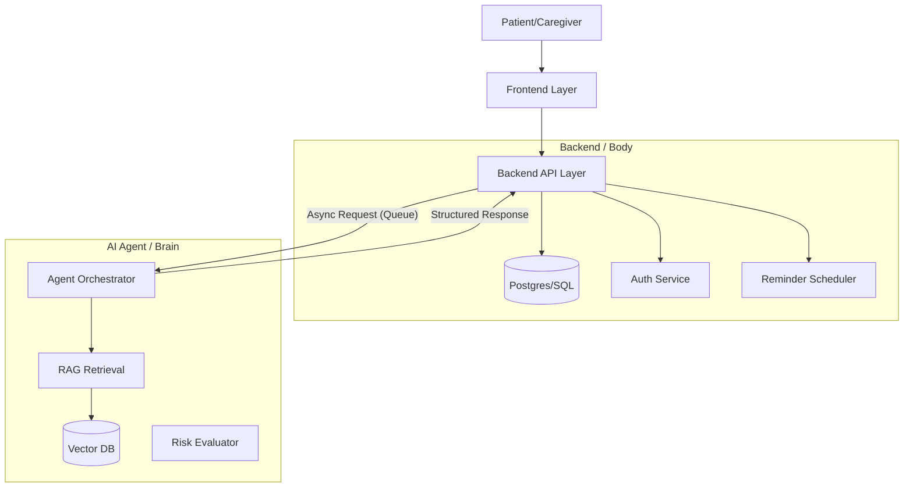

# Memo Architecture Overview

## Core Philosophy

Memo is designed as a **distributed system of concerns** rather than a monolithic application. We separate the "Brain" (AI Agent) from the "Body" (Backend/Data) and the "Face" (Frontend).

## High-Level Diagram

## System Layers

### 1. The Brain (/ai-agent)

**Responsibility:** "Thinking", reasoning, and retrieving memories.

- **Input:** Unstructured text/audio + Structured context.
- **Output:** Structured intent, text response, or tool call.
- **Constraints:** NO direct database access. NO UI components. stateless execution where possible.

### 2. The Body (/backend)

**Responsibility:** "Remembering", securing, and executing.

- **Responsibility:** Sources of truth (DB), Authentication, Scheduling (CRON/Queues).
- **Constraints:** No business logic in controllers. Strict separation of "Patient Data" (Structured) vs "Ai Memory" (Vector).

### 3. The Face (/frontend)

**Responsibility:** "Presenting" and accessibility.

- **Responsibility:** User experience, Accessibility (WCAG 2.1), Real-time updates.
- **Constraints:** Dumb components. Complexity lives in the Backend/AI.

## Key Decisions

- **Monorepo**: We use a monorepo to verify schemas across layers.
- **Async AI**: AI operations are slow. The frontend polls or uses websockets; the backend manages the job queue.
- **Privacy First**: PII is stripped before entering the Vector DB.
